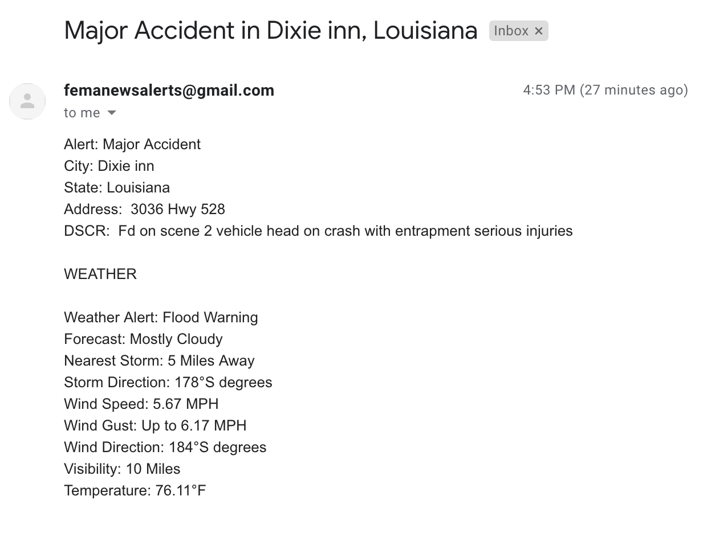
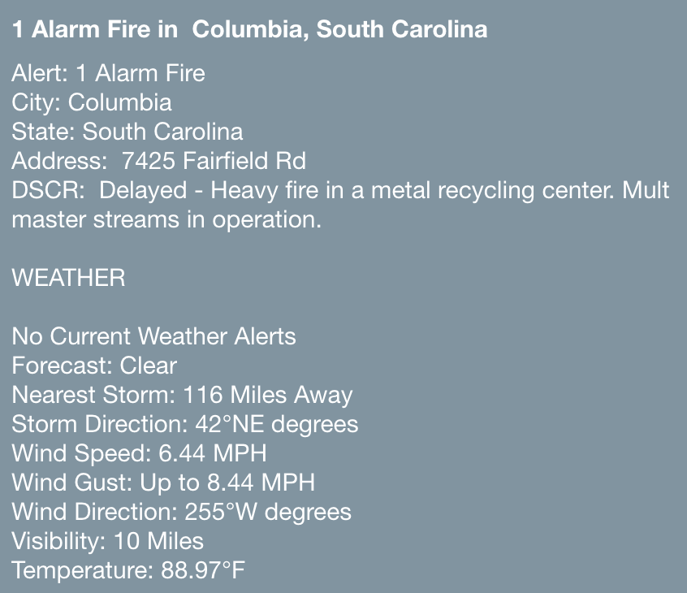

# Problem Statement

Currently, FEMA identifies areas that require immediate attention (for search and rescue efforts) either by responding to reports and requests put directly by the public or, recently, using social media posts. This tool will utilize live police radio reports to identify hot spots representing locations of people who need immediate attention. The tool will flag neighborhoods or specific streets where the police and first-respondents were called to provide assistance related to the event.

# Overview

What we wanted to do was create an alert system using data from police scanners to distribute alerts, based on location and type of alert, to subscribers via email.

# Code

### [Subscriber Sign Up](./Code/subscriber_sign_up.ipynb)
- #### Form subscribes users to receive alerts
  - #### Alerts based on desired location & desired alert type

### [Alert Pull](./Code/alert_pull.ipynb)
- #### Code to continuously pull alert data and send emails to subscribers
- ### Table Of Contents
    #### - [Executive Summary](./Code/alert_pull.ipynb/#Executive-Summary)
    #### - [Import Libraries](./Code/alert_pull.ipynb/#Import-Libraries)
    #### - [Defining Functions](./Code/alert_pull.ipynb/#Defining-Functions)
    #### - [Alert Pulling Code](./Code/alert_pull.ipynb/#Pulling-Alerts)

### Email Example

### IFTTT Example

# Database

### Archive of all alerts

[Alert Dataframe](./Code/Database/IPN_DF.csv)

### Grid to find subscribers based on city & alert

[Alert/City Dataframe](./Code/Database/Alert_City_DF.csv)

### List of Subscribers and their current preferences

[List of Subscribers](./Code/Database/list_of_emails.csv)

# Executive Summary
### Here is a link to our [Executive Summary](./Code/alert_pull.ipynb/#Executive-Summary)

# Data Acquisition/Cleaning

### Acquisition
##### Primary Data
We started to search for good places to get our data, we went to police stations, contacted stringers, found streams to listen to police scanners, and found online forums. most of these sources all pointed us towards Broadcastify. This is a service that aggregates as many police scanning streams as it can so it can be a one-stop-shop for police streams. Digging deeper into broadcastify, we found that Broadcastify has partnered up with a company called [IPN](#http://www.incidentpage.net). This company hires people to listen to these police scanners and type out alerts as they hear them being reportsed live. This service seemed like a no-breainer to us. After creating an account with IPN, we realized that IPN only issues alerts via SMS messages. There was no API and there archive only let us see the last 20 alerts in a specific area. While searching through the website, we came across a [ticker](http://www.incidentpage.net/members/ticker_content.js) that constantly updates and provides the 5 most recent alerts. We found the source of the ticker and we set our code to constantly refresh this sourse every 30 secinds to retreive the most recent alerts.

##### Complimentary Data
We created an account with Dark Sky and as each alert comes in, we are able to provide wearther info on that area and info on nearby storms. This is very helpful for responders like FEMA who would like to know the how strong the wind is so they know if there is a potential for a fire to spread quickly.

### Cleaning
We saw that there was a lot of whitespace in our data and the data was seperated by a "|" (pipe symbol)  
We decided to:
- Remove all whitespace
- Split each piece of data by the "|"
- Add the current Date

We then saw that some of the alerts were coming in with an extra piece of data (inter-city code) so we added a column in our dataframe that could account for that extra piece of data.

# Software Requirements

- ### Numpy
  - Helps us place Null values inside of our dataframe when necessary 
- ### Pandas
  - Helps us with all of our work with:
    - Pulling data from a CSV
    - Cleaning the new data
    - Merging the new and old data
    - Storing the data.
- ### MIME
  - Allows us to create the content for our email such as:
    - Message
    - Subject
    - From Address
    - To Address
- ### Smtplib
  - Allows us to start a session to send our emails
- ### Time
  - Allows us to have our loop wait 30 seconds before running again
- ### Datetime
  - Allows us to add the proper datetime to our alert based on the datetime that the alert was pulled 
- ### Bs4
  - BeautifulSoup
      - Allows us to properly look through and parse the content that we retrieve from the web
- ### Requests
  - Allows us to get content from a website 
- ### Re
  - Allows us to validate an email address by the format of the input
